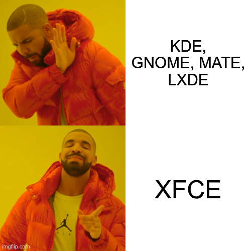
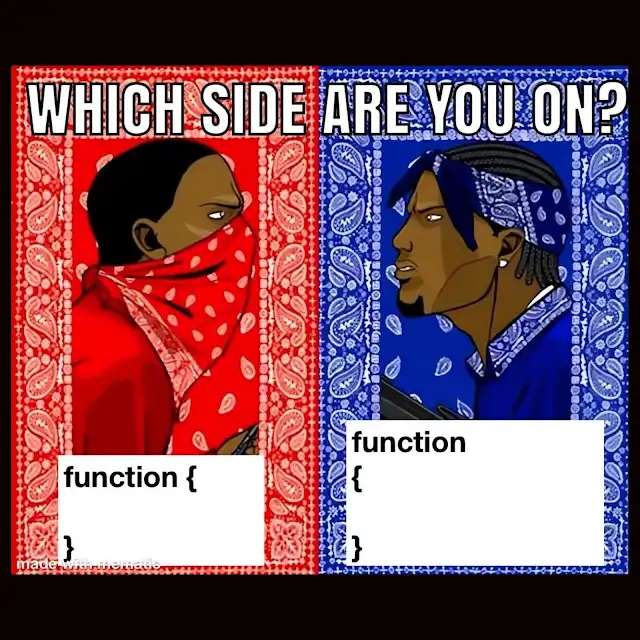
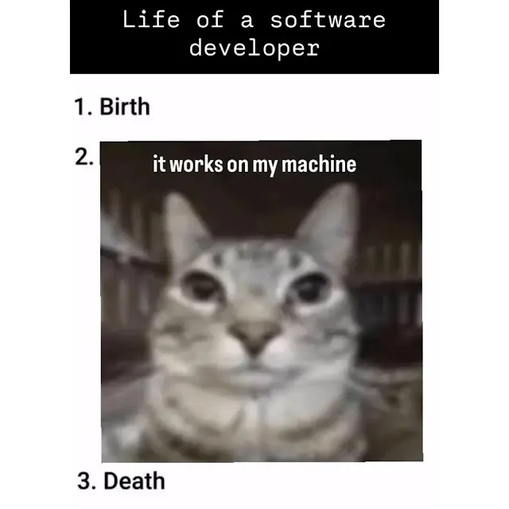

# Welcome to KaganSoftOfficial!

I'm a young and Linux-savvy person with a passion for software development. **I don't own a real company!** 

*My markdown skills are so bad because of that sometimes i use AI to make it...*

- ☢️ Sometimes I do projects that are necessary or unnecessary for people.
- 🔣 My programming languages of interest are [C#](https://tr.wikipedia.org/wiki/C_Sharp), [C++](https://tr.wikipedia.org/wiki/C%2B%2B), [GDScript](https://godotengine.org/), [Python](https://www.python.org/) and [HTML](https://tr.wikipedia.org/wiki/HTML).
- 🗺️ My development environment & tools are [Qt Creator](https://www.qt.io/development/tools/qt-creator-ide), [Code::Blocks](https://www.codeblocks.org/), [Godot Engine](https://godotengine.org/) and [VSCodium](https://vscodium.com/)
- 📳 I don't usually post repositories very often. *(You understand, unless I get any ideas. 😉)*
  
 

 
